# Markdown 文档进阶：树形结构、流程图与时序图

> 掌握在 Markdown 中绘制结构化图表的技巧，提升技术文档的可读性和专业性。

---

## 一、文件树形结构

用于展示项目目录结构、文件层级关系。

### 1.1 使用代码块 + 缩进

最简单的方式，纯文本，兼容所有 Markdown 渲染器。

```markdown
```
project/
├── src/
│   ├── components/
│   │   ├── Button.tsx
│   │   └── Input.tsx
│   ├── pages/
│   │   ├── Home.tsx
│   │   └── About.tsx
│   └── utils/
│       └── helpers.ts
├── public/
│   └── index.html
├── package.json
└── README.md
```
```

**渲染效果：**

```
project/
├── src/
│   ├── components/
│   │   ├── Button.tsx
│   │   └── Input.tsx
│   ├── pages/
│   │   ├── Home.tsx
│   │   └── About.tsx
│   └── utils/
│       └── helpers.ts
├── public/
│   └── index.html
├── package.json
└── README.md
```

**符号说明：**

| 符号 | 含义 |
|-----|------|
| `/` | 目录结尾标识 |
| `├──` | 中间节点（还有同级节点） |
| `└──` | 末尾节点（最后一个子节点） |
| `│` | 垂直连接线 |
| 缩进 | 层级关系，通常 4 空格或 Tab |

### 1.2 使用 tree 命令生成

在终端使用 `tree` 命令自动生成：

```bash
# 生成完整树形
tree -L 3 > structure.txt

# 忽略 node_modules
tree -L 3 -I 'node_modules|dist' > structure.txt

# 只显示目录
tree -d -L 2
```

### 1.3 Mermaid 树形图（图形化）

适合需要可视化展示的场景。

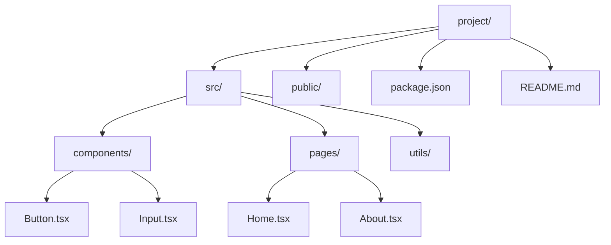

---

## 二、流程图（Flowchart）

使用 Mermaid 语法，被 GitHub、GitLab、Notion 等广泛支持。

### 2.1 基本语法

````markdown
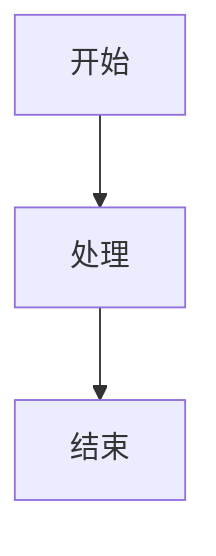
````

**渲染效果：**


### 2.2 方向定义

| 关键字 | 方向 | 用途 |
|-------|------|------|
| `TD` / `TB` | 从上到下 | 垂直流程 |
| `BT` | 从下到上 | 逆向流程 |
| `LR` | 从左到右 | 水平流程 |
| `RL` | 从右到左 | 反向流程 |


### 2.3 节点形状

| 语法 | 形状 | 用途 |
|-----|------|------|
| `A[文本]` | 矩形 | 普通步骤 |
| `A(文本)` | 圆角矩形 | 开始/结束 |
| `A((文本))` | 圆形 | 连接点 |
| `A{文本}` | 菱形 | 判断/决策 |
| `A[/文本/]` | 平行四边形 | 输入/输出 |
| `A[\文本\]` | 梯形 | 手动操作 |
| `A>文本]` | 不对称矩形 | 延迟/等待 |

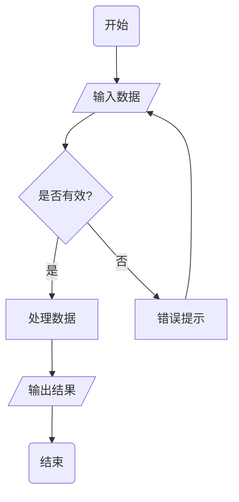

### 2.4 连接线样式

| 语法 | 线型 | 说明 |
|-----|------|------|
| `-->` | 实线箭头 | 默认正向 |
| `---` | 实线无箭头 | 关联 |
| `-.->` | 虚线箭头 | 异步/间接 |
| `==>` | 粗线箭头 | 强调重点 |
| `--文字-->` | 带标签 | 说明条件 |
| `-->|文字|` | 箭头带标签 | 条件分支 |

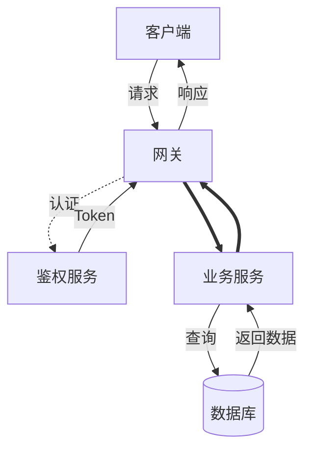

### 2.5 子图分组

用于模块化展示复杂流程。

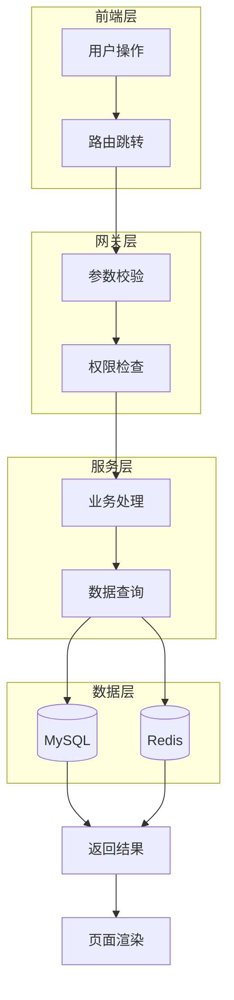

### 2.6 样式设置

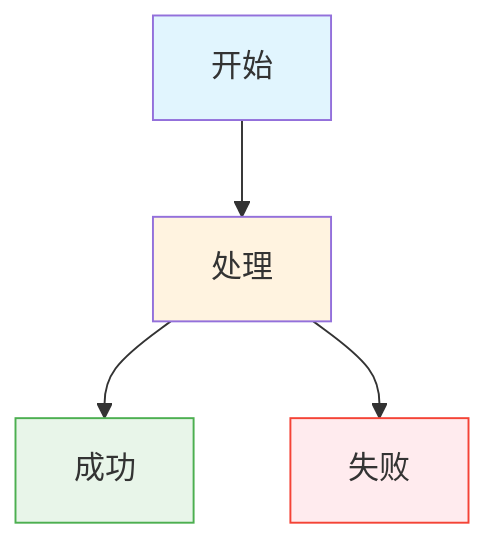

---

## 三、时序图（Sequence Diagram）

展示对象间的交互顺序，适合描述 API 调用、业务流程。

### 3.1 基本语法

````markdown
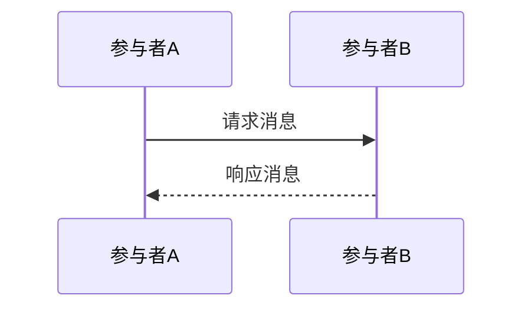
````

**渲染效果：**


### 3.2 参与者定义

| 语法 | 说明 |
|-----|------|
| `participant 名称` | 声明参与者 |
| `actor 名称` | 声明角色（人形图标） |
| `as 别名` | 定义别名简化引用 |

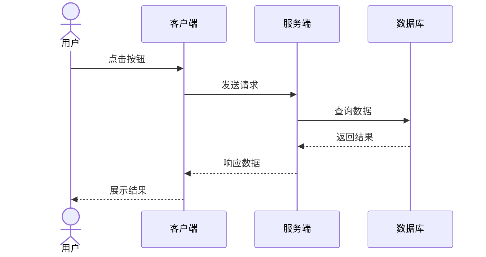

### 3.3 消息类型

| 语法 | 含义 | 线型 |
|-----|------|------|
| `->` | 实线无箭头 | 普通消息 |
| `-->` | 虚线无箭头 | 返回/异步 |
| `->>` | 实线箭头 | 同步调用 |
| `-->>` | 虚线箭头 | 异步返回 |
| `-x` | 实线叉号 | 删除/终止 |
| `--x` | 虚线叉号 | 异步删除 |
| `-)` | 实线开放箭头 | 创建消息 |

### 3.4 激活框（生命线）

表示对象处于活动状态。

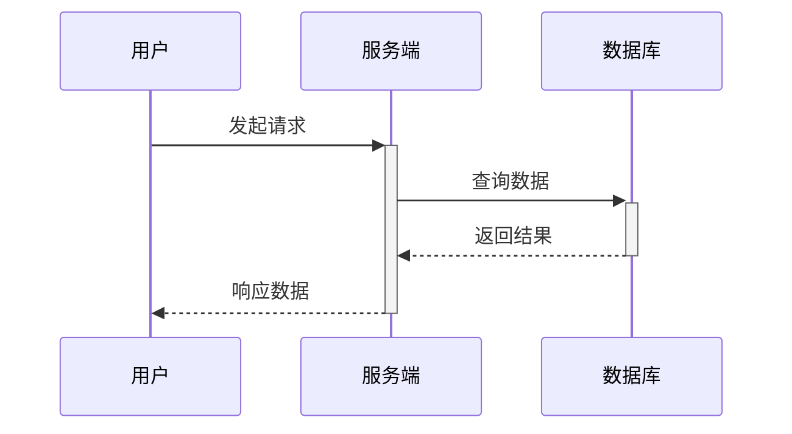

**语法说明：**
- `+` 激活开始
- `-` 激活结束

### 3.5 自调用与循环

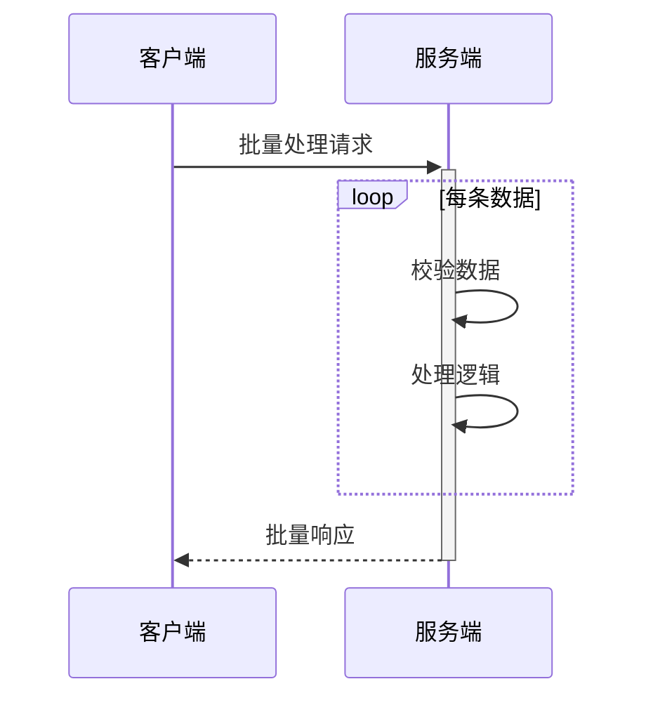

**控制结构：**

| 语法 | 用途 |
|-----|------|
| `loop 标签` | 循环 |
| `alt 条件` | 条件分支（if-else） |
| `opt 条件` | 可选（if，无 else） |
| `par` | 并行处理 |
| `rect 颜色 标签` | 区域高亮 |
| `note 位置 对象: 内容` | 添加注释 |

### 3.6 完整示例：用户登录流程

```mermaid
sequenceDiagram
    autonumber
    actor U as 用户
    participant App as App
    participant API as API网关
    participant Auth as 认证服务
    participant UserDB as 用户数据库
    participant Redis as 缓存
    
    U->>+App: 输入账号密码
    App->>App: 前端校验格式
    
    alt 格式正确
        App->>+API: POST /login
        API->>+Auth: 验证身份
        Auth->>+UserDB: 查询用户信息
        UserDB-->>-Auth: 返回用户数据
        Auth->>Auth: 密码比对
        
        alt 密码正确
            Auth->>Redis: 写入 Token
            Auth-->>-API: 返回 Token
            API-->>-App: 登录成功
            App-->>-U: 跳转首页
        else 密码错误
            Auth-->>-API: 认证失败
            API-->>-App: 错误码 401
            App-->>-U: 提示密码错误
        end
    else 格式错误
        App-->>-U: 前端提示格式错误
    end
    
    Note over U,Redis: 登录成功后续操作...
```

---

## 四、其他常用图表

### 4.1 状态图（State Diagram）

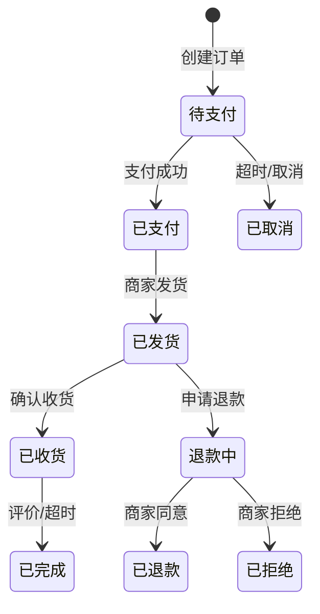

### 4.2 类图（Class Diagram）

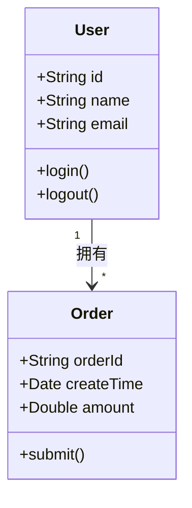

### 4.3 ER 图（实体关系）

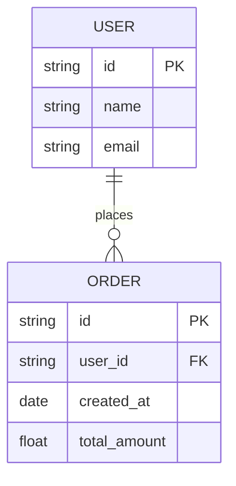

### 4.4 甘特图（Gantt）

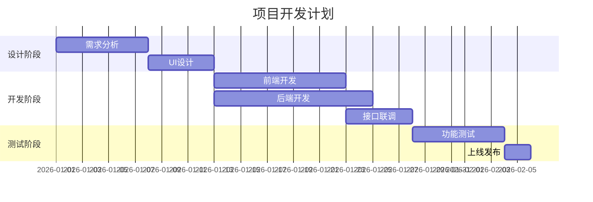

---

## 五、平台兼容性说明

| 平台 | Mermaid 支持 | 备注 |
|-----|-------------|------|
| GitHub | 原生支持 | 代码块直接渲染 |
| GitLab | 原生支持 | 同 GitHub |
| Notion | 原生支持 | `/mermaid` 命令 |
| Typora | 原生支持 | 实时预览 |
| VS Code | 需插件 | Markdown Preview Mermaid |
| Obsidian | 需插件 | Mermaid Tools |
| 自建 Docs | 需 JS 库 | mermaid.js |

**不支持 Mermaid 的替代方案：**

1. **截图**：在 [Mermaid Live Editor](https://mermaid.live/) 生成后截图插入
2. **ASCII 图**：纯文本流程图，兼容性最好
3. **SVG 导出**：Mermaid Live Editor 支持导出 SVG 文件

---

## 六、实用工具推荐

| 工具 | 用途 | 链接 |
|-----|------|------|
| Mermaid Live Editor | 在线编辑、实时预览、导出图片 | https://mermaid.live/ |
| Mermaid CLI | 命令行生成图表 | npm install -g @mermaid-js/mermaid-cli |
| Mermaid JS | 网页嵌入支持 | https://cdn.jsdelivr.net/npm/mermaid/dist/mermaid.min.js |
| Markdown Preview Enhanced | VS Code 插件 | 搜索安装 |

---

## 七、快速参考卡片

### 流程图速查

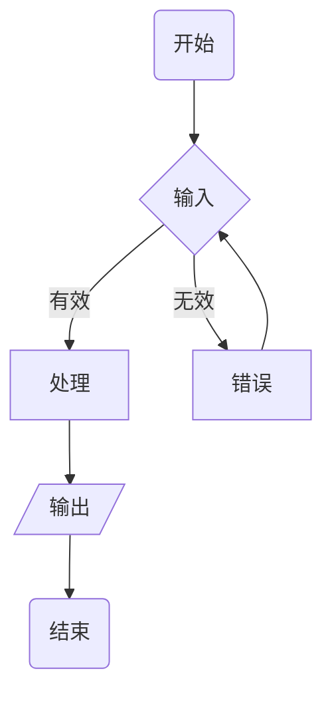

### 时序图速查

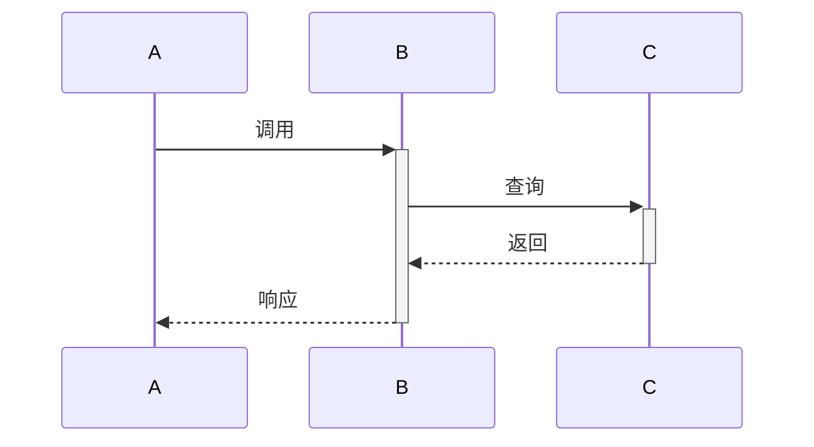

---

## 八、总结

| 场景 | 推荐方案 | 复杂度 |
|-----|---------|--------|
| 文件目录 | 代码块 + tree 缩进 | 低 |
| 简单流程 | ASCII 或 Mermaid flowchart | 中 |
| 复杂流程 | Mermaid flowchart + subgraph | 中 |
| 交互流程 | Mermaid sequenceDiagram | 中 |
| 状态转换 | Mermaid stateDiagram | 中 |
| 系统设计 | Mermaid 多图组合 | 高 |

**建议**：技术文档优先使用 Mermaid，兼容性要求高时备选用 ASCII 或截图。

---

*文档创建日期：2026-03-26*
